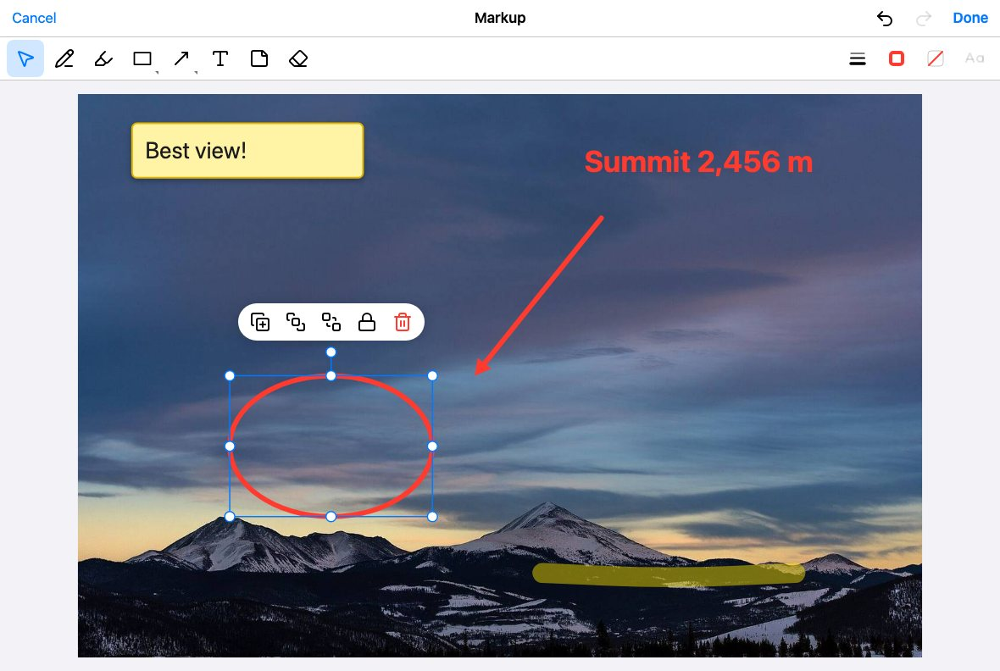
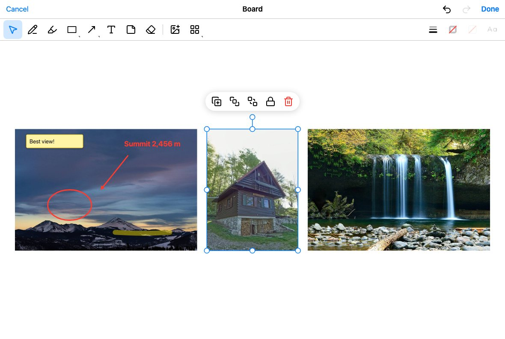
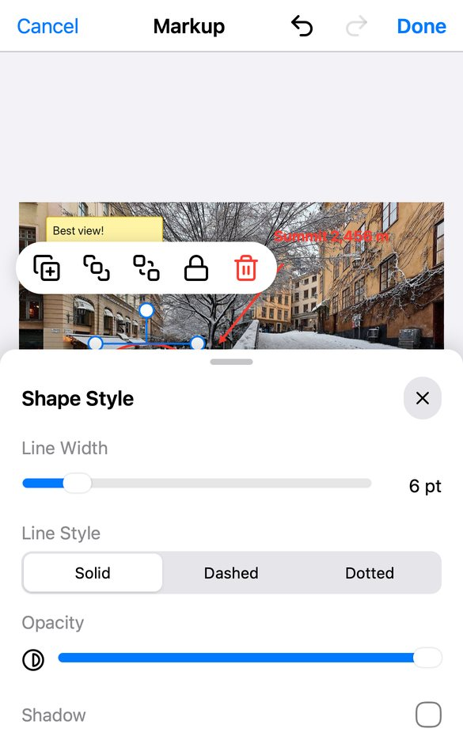
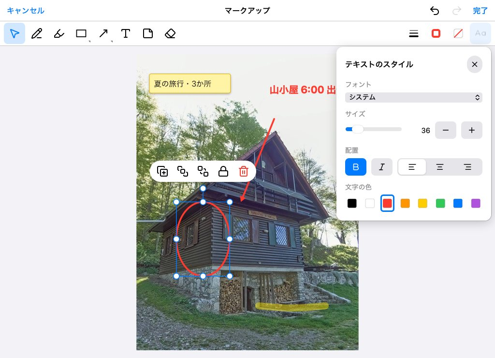

# image-markup-kit

Photo markup and multi-photo boards for React: pen, highlighter, shapes, arrows, polylines and curves, text and
sticky notes, flattened to one JPEG or PNG.

| Annotate a photo                                                           | Board: several photos                                          |
| -------------------------------------------------------------------------- | -------------------------------------------------------------- |
|  |  |

| Phone: toolbar at the bottom, panels as sheets                    | Tablet: Japanese, one-row toolbar, popovers                             |
| ----------------------------------------------------------------- | ----------------------------------------------------------------------- |
|  |  |

The web counterpart of [ImageMarkupKit](https://github.com/thnhsng/ImageMarkupKit) (Swift/UIKit): the same tools and
behavior, and the same `document.json` (schema 1), byte for byte, so a markup started on iOS can be edited on the
web and the other way around.

- **Annotate a photo**: pen, highlighter, shapes (rectangle, rounded rectangle, oval, circle, square, triangle,
  diamond, star, pentagon, speech bubble, highlight box), arrows and lines, polylines, curves, text, sticky notes and
  an object eraser. Every mark is an object: select, move, resize, rotate, restyle, duplicate, lock, reorder, undo
  and redo.
- **Board**: several photos side by side; move, resize and rotate them, add more, arrange them (row, column, grid,
  tidy up). Arrows attach to points on photos and follow them; marks drawn on a photo move with it.
- **Export**: one flattened JPEG (or PNG) at the photos' resolution, within browser canvas limits, optionally under
  a byte limit.
- **Editable again**: Done also returns the document and the original photos, and can build a package
  (`document.json`, photos, export, thumbnail) like the Swift package's.
- Mouse, pen and touch: pinch to zoom, wheel and trackpad zoom, keyboard shortcuts, input methods (IME).
- English and Japanese, every string replaceable; themable with CSS variables.
- No runtime dependencies besides React.

## Requirements

- React 18 or 19 (`react` is the only peer dependency; `react-dom` is not imported).
- Browsers: current Chrome, Edge, Firefox and Safari; Safari 15 and later on iOS and iPadOS.
- Create React App 5 (webpack 5, Jest 27), Vite and other bundlers; TypeScript 4.9 and later. The package ships
  CommonJS and ES modules with type declarations, and touches no browser API until the editor mounts, so it can be
  imported during server rendering (the editor itself renders on the client: the module starts with `"use client"`).

## Installation

```sh
npm install image-markup-kit@~0.1.0
```

`~0.1.0` takes patch releases (0.1.x) and stays on 0.1, like Xcode's "Up to Next Minor Version". Versions follow
[Semantic Versioning](https://semver.org); before 1.0, minor versions may contain breaking changes (see
[CHANGELOG.md](CHANGELOG.md)).

## Usage

```tsx
import { MarkupEditor, type MarkupResult } from 'image-markup-kit';

function PhotoMarkup({ photo, onClose }: { photo: Blob; onClose: () => void }) {
  const save = async (result: MarkupResult) => {
    await upload(result.blob); // the editor stays busy until this settles
    onClose();
  };
  return (
    // The editor fills its container: give the container a size.
    <div style={{ position: 'fixed', inset: 0 }}>
      <MarkupEditor image={photo} onDone={save} onCancel={onClose} />
    </div>
  );
}
```

The editor never closes itself: unmount it from `onDone` or `onCancel`, as with the Swift editor's delegate.

- `image`: one photo to annotate (a `Blob` or `File`, an `HTMLImageElement`, `ImageBitmap`, a canvas, or a URL the
  browser can fetch).
- `images`: photos for a board, side by side in this order.
- `document` and `assets`: a document to edit again, with the original photos it uses (by asset ID).

Give exactly one of them. Photos are read, never changed: the editor keeps their original bytes for the export and
the package, and shows smaller copies on screen.

### Done

```ts
interface MarkupResult {
  blob: Blob; // the flattened image (JPEG by default)
  pixelSize: { width: number; height: number };
  isClamped: boolean; // the pixel limits reduced the natural resolution
  exceedsMaxBytes: boolean; // a JPEG with maxBytes is still larger after every fallback quality
  warnings: MarkupWarning[]; // photos drawn as gray boxes (missing, or not decodable here)
  document: MarkupDocument; // open it again with the document prop
  assets: MarkupAssets; // the original bytes of the photos the document uses
  package: MarkupPackageFiles | null; // with includePackage: document.json, assets/…, export.jpg, thumbnail.jpg
}
```

`onDone` may return a Promise: Done shows a spinner and the editor ignores input until it settles. If it rejects, the
editor stays open and editable (your code reports the error; `onError` is not called). `onError` reports photos that
could not be opened and exports that failed, as `MarkupError` (check `error.code`).

Cancel asks before discarding changes; `onCancel` is called when the user confirms, or right away when nothing
changed.

### Options

```tsx
<MarkupEditor
  images={photos}
  configuration={{
    title: 'Site photos',
    locale: 'ja', // 'en' (default) or 'ja'
    navigationTexts: { done: 'Save' }, // Done, Cancel and the discard dialog
    strings: { shapeNames: { star: 'Star' } }, // any other string
    features: MarkupFeatures.fromJSON(json), // which tools and buttons to offer (below)
    styleDefaults: myDefaults, // colors, widths and fonts of new items
    exportOptions: { format: { type: 'jpeg', quality: 0.85, maxBytes: 10_000_000 }, maxPixelDimension: 4096 },
    includePackage: true, // Done also builds the editable package
    theme: { accent: '#0A84FF' }, // CSS variables (below)
    fontStacks: { hiraginoSans: { family: '"Hiragino Sans", "Noto Sans JP", sans-serif' } },
    styleNonce: cspNonce, // for a Content Security Policy without 'unsafe-inline'
    showHeader: false, // to drive the editor from your own header
    onAddImagesRequest: async (source) => pickPhotos(), // a board's Add Images, instead of the file picker
  }}
  onDone={save}
  onCancel={close}
  onStateChange={(state) => setCanSave(state.hasChanges)}
/>
```

`features`, `styleDefaults` and `fontStacks` are read once, when the editor opens; the other options apply as they
change. To start over with another document, give the editor a new `key`.

Export options: `format` (`{ type: 'jpeg', quality, maxBytes?, fallbackQualities? }` or `{ type: 'png' }`),
`maxPixelDimension` (8192), `maxPixelCount` (16,000,000), `boardPadding` (24) and `minimumBoardScale` (2). The pixel
count default is lower than the Swift package's 40 MP because Safari on iOS refuses canvases above 16.7 MP; pass
`maxPixelCount: 40_000_000` for desktop-only apps. With `maxBytes`, a JPEG that is too large is encoded again at each
`fallbackQualities` step (0.75, 0.6, 0.5 by default) from the same canvas.

### Controlling the editor

```tsx
const editor = useRef<MarkupEditorHandle>(null);
<MarkupEditor ref={editor} … />;

editor.current?.setTool('arrow');   // tools turned off in the features are ignored
editor.current?.undo();
editor.current?.zoomToFit();
editor.current?.arrange('grid');    // boards
await editor.current?.done();       // same as tapping Done
editor.current?.getDocument();      // the document as edited
editor.current?.debug.perform({ type: 'draw', tool: 'pen', points: [{ x: 10, y: 10 }, { x: 90, y: 40 }] });
```

The handle stays the same object for the editor's lifetime. `debug` runs scripted gestures through the editor's real
interactions, for tests and screenshots.

### Turning tools off

The same JSON as the Swift package's `MarkupFeatures.json`, so iOS and web apps can share one file:

```json
{
  "draw": { "enabled": true, "items": { "pen": true, "highlighter": false } },
  "shapes": { "enabled": false },
  "lines": { "items": { "curve": false } },
  "actions": { "items": { "lock": false } }
}
```

| Group     | Items                                                                                                                                  |
| --------- | -------------------------------------------------------------------------------------------------------------------------------------- |
| `draw`    | `pen`, `highlighter`                                                                                                                   |
| `shapes`  | `rectangle`, `roundedRectangle`, `oval`, `circle`, `square`, `triangle`, `diamond`, `star`, `pentagon`, `speechBubble`, `highlightBox` |
| `lines`   | `arrow`, `polyline`, `curve`                                                                                                           |
| `text`    | `text`, `note`                                                                                                                         |
| `eraser`  | `eraser`                                                                                                                               |
| `style`   | `shapeStyle`, `borderColor`, `fillColor`, `textStyle`                                                                                  |
| `board`   | `photoLibrary`, `camera`, `arrange`                                                                                                    |
| `actions` | `editText`, `duplicate`, `bringToFront`, `sendToBack`, `lock`, `delete`                                                                |

`MarkupFeatures.fromJSON(json)` throws `MarkupFeaturesError` for unknown names and wrong value types; keys starting
with `_` are ignored. Turned-off items leave the toolbar, menus, action bar and keyboard shortcuts; a menu left with
one entry becomes a plain button. `MarkupFeatures.all.toJSONString()` writes a complete template. On the web,
`photoLibrary` is the file picker, and `camera` is offered on touch devices.

### Keyboard

⌘ on Apple platforms, Ctrl elsewhere: ⌘Z undo, ⇧⌘Z (or Ctrl+Y) redo, ⌘0 zoom to fit, ⌘D duplicate; Delete or
Backspace deletes; Escape closes a panel, finishes a polyline, returns to Select, then clears the selection. Tools:
V select, P pen, H highlighter, A arrow, L polyline, C curve, T text, N note, E eraser. Shortcuts work while the
editor has the focus and stop there, so Escape does not also close a dialog around the editor; they are off while
text is typed and during input-method composition.

### Theme and Content Security Policy

The editor's colors are CSS variables on its root, with light defaults: `accent`, `accentSoft`, `surface`, `canvas`,
`fill`, `text`, `secondaryText`, `disabled`, `separator`, `danger`, `success` and `font` (as `--imk-accent`,
`--imk-accent-soft`, …). Pass `theme`, or set the variables from your CSS. There is no automatic dark mode.

The stylesheet is one `<style>` element per document (or shadow root), present while an editor is mounted. Under a
Content Security Policy whose `style-src` has no `'unsafe-inline'`, pass the policy's nonce as `styleNonce`. Element
styles are set through the DOM (CSSOM), which such a policy allows.

### Rendering and packages without the editor

```ts
import {
  createMarkupPackage,
  parseDocument,
  readMarkupPackage,
  renderMarkup,
  serializeDocument,
} from 'image-markup-kit';

const rendering = await renderMarkup(document, assets, { format: { type: 'png' } });
const json = serializeDocument(document); // the same bytes as the Swift JSONEncoder
const again = parseDocument(json); // decodes Swift-written documents too
const files = await createMarkupPackage(document, assets, rendering.blob);
const { document: opened, assets: photos } = await readMarkupPackage(files);
```

Packages are plain file maps (`{ 'document.json': Blob, 'assets/…': Blob, … }`): store them wherever you like. The
model functions (`createBoardDocument`, `createShapeItem`, `createTextItem`, `createConnectorItem`,
`attachAnnotationsToPhotos`, `planExport`, …) are exported for building documents in code.

## document.json

Coordinates are canvas units, independent of photo resolution: in image mode the photo's long edge is 1024 units; on
a board photos are 600 units high. Export density follows the photos' pixels.

```jsonc
{
  "schemaVersion": 1,
  "id": "…",
  "kind": "image",                    // or "board"
  "backgroundItemID": "…",            // image mode: the locked background photo
  "backgroundColor": "#FFFFFFFF",
  "items": [                          // bottom first; photos always below annotations
    { "id": "…", "type": "image", "content": { "assetID": "….jpg", "pixelSize": [4032, 3024], "box": { "frame": [[0, 0], [1024, 768]], "rotation": 0 } } },
    { "id": "…", "type": "shape", "content": { "kind": "ellipse", "box": { … }, "lockAspect": false },
      "style": { "strokeColor": "#FF3B30FF", "fillColor": "#FFCC004D", "lineWidth": 6, "dash": "solid", "opacity": 1, "cornerRadius": 0, "shadow": false } },
    { "id": "…", "type": "line", "content": { "start": { "point": [x, y], "binding": { "itemID": "…", "anchor": [0.3, 0.8] } }, "end": { "point": [x, y] },
      "startHead": "none", "endHead": "arrow", "kind": "curve", "waypoints": [[x, y]] } }
  ]
}
```

The editor writes what the Swift `JSONEncoder` writes (sorted keys, the same number and string formatting) and reads
documents the way Swift's `Codable` does: unknown item types are skipped, so older apps open newer files, and a
`schemaVersion` above 1 is refused with the `MarkupError` code `unsupportedSchemaVersion`.

## Browsers

- HEIC photos decode in Safari only. Elsewhere they show as gray boxes (with a warning in the result) and keep their
  original bytes, so the document stays complete.
- EXIF orientation is applied, also where the browser would not, so photos from phones are upright.
- Photos are decoded at most two at a time (one at a time above 24 MP), and the export canvas is retried smaller when
  the browser refuses its size.
- Text uses the iOS line metrics, so boxes have the same height as on iOS; line breaks can differ slightly with
  other fonts. Give `fontStacks` web fonts to match more closely.

## Known limitations

- One item selected at a time; no crop; the eraser removes whole objects; connectors are straight.
- Text is edited unrotated.
- English and Japanese built in; other languages through `strings` and `navigationTexts`.

## Example app

`npm run example` serves `example/` with the library from source: sample photos, boards, your own photos, every
option, and what Done returns. Links like `?open=waterfall.jpg&demo=1&panel=shapeStyle` open the editor with markup,
for screenshots on devices without automation.

## Credits

Icons from [Lucide](https://lucide.dev) (ISC); see [THIRD_PARTY_NOTICES.md](THIRD_PARTY_NOTICES.md). The design
follows ImageMarkupKit, which draws on ideas from [Drawsana](https://github.com/Asana/Drawsana) (MIT). The example
app's sample photos are from Wikimedia Commons (CC0), credited in
[example/public/samples/CREDITS.md](example/public/samples/CREDITS.md).

## License

MIT. See [LICENSE](LICENSE).
